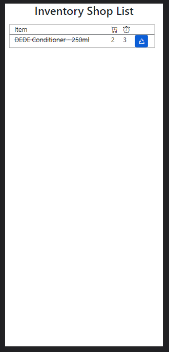

# InventoryList

This application combines the results from two Square APIs: 
* CatalogAPI
* InventoryAPI

The result is a shopping list for purchasing items identified as out-of-stock or low in inventory. When a user is picking items at the supplier, items on the list can be crossed-off as shopped.

This project was generated with [Angular CLI](https://github.com/angular/angular-cli) version 14.2.4. It will eventually deployed as a serverless application hosted in AWS.

## Development server

Run `ng serve` for a dev server. Navigate to `http://localhost:4200/`. The application will automatically reload if you change any of the source files.

## Code scaffolding

Run `ng generate component component-name` to generate a new component. You can also use `ng generate directive|pipe|service|class|guard|interface|enum|module`.

## Build

Run `ng build` to build the project. The build artifacts will be stored in the `dist/` directory.

## Running unit tests

Run `ng test` to execute the unit tests via [Karma](https://karma-runner.github.io).

## Running end-to-end tests

Run `ng e2e` to execute the end-to-end tests via a platform of your choice. To use this command, you need to first add a package that implements end-to-end testing capabilities.

## Further help

